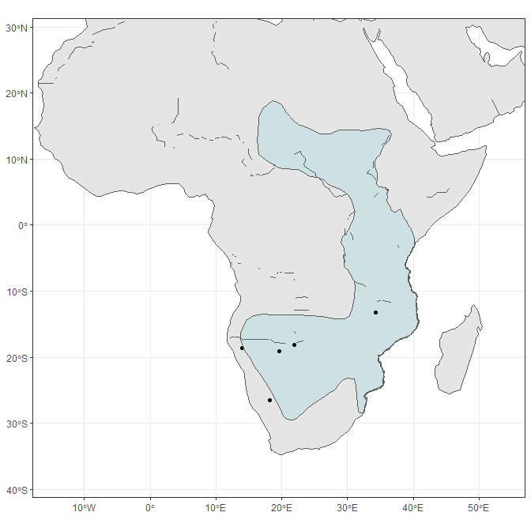
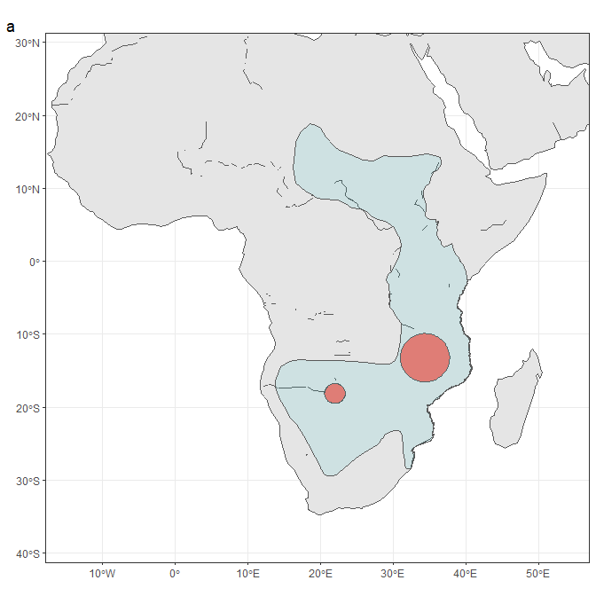
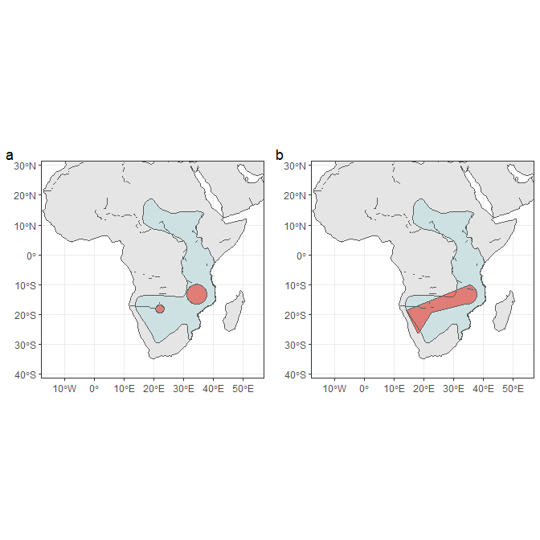
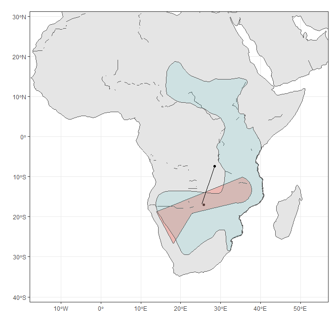

sfe (Simple Features Ecology)
================

[](https://zenodo.org/badge/latestdoi/193727104)

## A Walkthrough Guide With a Test Case

### A Brief Note about Dependencies

sfe was built in Ubuntu 18.04, and tested in Windows 10, so should work
across operating systems. However initial setup on Linux machines can be
fairly complicated. Please go to the end of this document for a guide to
installation on Lunix based computers.

## Installing sfe

In R run the command `devtools::install_github("JCur96/sfe", force =T)`
followed by

``` r
library(sfe)
library(rgeos)
library(rgdal)
library(ggplot2)
library(Hmisc)
```

The package is now loaded and ready for use.

## A walkthrough With a Test Case

Here I will run through the exact code I have used in my Masters Thesis
as a demonstration of how to use this package. The test case I’m looking
at is the Manidae family (pangolins). Data were collected by Buckingham
(2019, unpublished Masters Thesis) from the Natural History Museum,
London (NHM) collections, and consisted of 215 georeferenced specimens
from seven of the eight species of pangolin. There are eight species of
pangolin in three genera, distributed over two continents (Africa and
Asia). The NHM collections are missing specimens of  as this species was
only formally recognised as a distinct species in 2005, and only lives
in the Philippines, and none of the specimens have that as their
locality.

The NHM data can be kept under version control using datastorr and
potentially downloaded with this package, however that data is currently
proprietary so will be read off of my machine locally in this example.
For a more comprehensive overview of how to use datastorr please see the
vignette on <https://github.com/ropenscilabs/datastorr> Initially
setting up datastorr can be slightly difficult, but it boils down to
running this command; `datastorr:::autogenerate(repo="JCur96/sfe",
read="read.csv")` which produces several functions which are then used
for data management, and then making an initial release of the data. I
will give a brief example of how to use those functions here out of
interest;

``` r
# First it is advisable that you check if you've got the data already
sfe::mydata_versions()
#> character(0)
# If not, you can check what versions are available on GitHub
sfe::mydata_versions(local=F)
#> [1] "0.0.0.9001" "1.0"
# From those you can choose the version you wish to work with
myFakePangolinData <- sfe::mydata(version = '0.0.0.9001')
#> 
Downloading: 610 B     
Downloading: 610 B     
Downloading: 610 B     
  |                                                                       
  |                                                                 |   0%
  |                                                                       
  |=================================================================| 100%
# Once you've made any edits to the data you can upload it to version control
sfe::updateVersion()
#> please enter new version number:
#> Error in print("IMPORTANT!\n  Please make note of whether the version update is due to changes to\n        data or because of updates made to the code in the package in your\n        commit message"/n/n/n): object 'n' not found
# UpdateVersion helps you update the description file before you make a new release
sfe::mydata_release()
#> Error in datastorr::github_release_create(mydata_info(path), ...): filename must be given
```

The errors you see here are because I’m not giving the functions the
correct input, but I promise they d0 work when they have correct input.

First I read in the data from both NHM and the
IUCN.

``` r
NHM_Pangolins <- read.csv("./data/NHMPangolinsCompatability.csv", header=T)
IUCN <- inReadOld(path = './data', name = 'maps_pholidota')
#> [1] "This may take some time"
#> OGR data source with driver: ESRI Shapefile 
#> Source: "F:\GitRepos\sfe\sfe\data", layer: "maps_pholidota"
#> with 45 features
#> It has 27 fields
```

Then I wrangle the data. This involves changing a key column to
“binomial” as many of the functions to follow rely on the data having
a column of species names under the column header of “binomial”. It also
involves removing spaces from between binomial names, and filtering out
blank or NA values from other key columns, as well as converting both
data frames to the sf format, making sure both are projected in latitude
and longitude.

``` r
NHM_Pangolins <- prepNHMData(NHM_Pangolins, 6)
#>  [1] "Longitude"          "Latitude"           "RegistrationNumber"
#>  [4] "Year"               "Decade"             "Binomial"          
#>  [7] "TypeStatus"         "Continent"          "Country"           
#> [10] "Locality"           "Extent..m."         "Certainty"         
#> [13] "Type"               "NOTES"              "X"
# To prove that this has done what we want, we could view the first ten rows
# but to save you from reading an output, I'll just tell you that
# it's not quite ready yet as it still contains a lot of missing values.
# Filtering out records which don't have a decade should help.
# We also don't really need all the notes at the moment, so we can drop that column
NHM_Pangolins <- NHM_Pangolins %>% filter(Decade != is.na(Decade))
NHM_Pangolins <- NHM_Pangolins %>% select(-c(NOTES))
IUCN <- prepIUCNData(IUCN)
```

There’s a lot of extra information in the IUCN data sets, but I won’t
filter that out, depending on what you are doing different parts will be
useful, and I cannot devise an algorithm to usefully sort that for every
case.

I then filter both data sets to contain only species entries which occur
in both data sets. This function will reassign the IUCN data to the
global environment but with only matching species. I did this as a
substitute for being able to return two objects from a function in R.

``` r
NHM_Pangolins <- matchBinomial(NHM_Pangolins, IUCN)
```

And can unify some naming conventions of Type, if the data has that
information;

``` r
NHM_Pangolins <- fixTypeNames(NHM_Pangolins)
```

Now that the data has been reduced to only usable records I can get into
the meat of the functions I’ve written; adding error to point data and
converting that data into convex hulls. First I need to change the
Extent column into kilometers and rename it to reflect that change. Then
I can add a `buffer` to the point data using the point-radius method.

``` r
NHM_Pangolins$Extent..m. <- (NHM_Pangolins$Extent..m. /1000)
NHM_Pangolins <- NHM_Pangolins %>% rename(Extent_km = Extent..m.)
# Here I make a plot to demonstrate how the NHM has been using georeferenced
# specimens
egForPlot <-NHM_Pangolins %>% filter(binomial == 'Smutsia_temminckii')
IUCNForPlot <- IUCN %>% filter(binomial == 'Smutsia_temminckii')
bbox <- c(-14.414063,-37.996163,53.613281,27.994401)
xlim <- c(bbox[1], bbox[3])
ylim <- c(bbox[2], bbox[4])
landMap <- rnaturalearth::ne_countries(returnclass = 'sf') %>%
  st_union()
p = ggplot(data = landMap) +
  geom_sf() +
  geom_sf(mapping = aes(alpha = 0.5, fill='blue'), data = egForPlot , show.legend = F) +
  geom_sf(mapping = aes(alpha = 0.1, fill = "red"), data = IUCNForPlot, show.legend = F) +
  coord_sf(xlim = xlim, ylim = ylim, expand = T) +
  theme_bw()
print(p)
```

<!-- -->

``` r
ggsave('../output/figure1.pdf', p, 'pdf')
#> Error in grDevices::pdf(file = filename, ..., version = version): cannot open file '../output/figure1.pdf'
# I then add error to the plot
NHM_Pangolins <- addError(NHM_Pangolins)
# head(NHM_Pangolins)
```

At this point I thought it would be useful to explore the data visually,
both out of interest and to double check that I really was converting
point data into point-radius
data.

``` r
# This function plots maps, but does not display them, it plots and saves them
# in a pre-made destination folder which you are prompted to enter the path to
# when you run this function. This both saves computer time and memory, whilst
# allowing you as the user to browse all the maps at your leisure.
plotMaps(NHM_Pangolins, IUCN, path = '../output/point_radius_graphs/')
#> Error in png(paste(path, var, ".png", sep = ""), width = 600, height = 500, : unable to start png() device
# Here is an example of a single plot from that command, or how to plot just one
# graph that is of interest
egForPlot <-NHM_Pangolins %>% filter(binomial == 'Smutsia_temminckii')
IUCNForPlot <- IUCN %>% filter(binomial == 'Smutsia_temminckii')
# puts the coords into the order expected down in ggmap coords
bbox <- c(-14.414063,-37.996163,53.613281,27.994401)
xlim <- c(bbox[1], bbox[3])
ylim <- c(bbox[2], bbox[4])
landMap <- rnaturalearth::ne_countries(returnclass = 'sf') %>%
  st_union()
p = ggplot(data = landMap) +
  geom_sf() +
  geom_sf(mapping = aes(alpha = 0.5, fill='blue'), data = egForPlot , show.legend = F) +
  geom_sf(mapping = aes(alpha = 0.1, fill = "red"), data = IUCNForPlot, show.legend = F) +
  coord_sf(xlim = xlim, ylim = ylim, expand = T)  +
  labs(tag = 'a') +
  theme(plot.margin=grid::unit(c(0,0,0,0), "mm")) +
  theme_bw()
print(p)
```

<!-- -->

``` r
ggsave('../output/figure4a.pdf', p, 'pdf')
#> Error in grDevices::pdf(file = filename, ..., version = version): cannot open file '../output/figure4a.pdf'
```

Not all maps will seem to show anything interesting, but that is mostly
due to the scale of the maps versus the scale of the species ranges in
some cases. Correctly scaling the maps is quite difficult as I am
dealing with global distributions, whereas some range records seem to
indicate a range of just a handful of kilometers.

Some of these maps show range overlap, but what kind of percentage? The
next set of functions calculate percentage overlap between point-radius
or convex hull data, depending on whether the user has used the convex
hull generating functions yet or not.

``` r
# For speed and viewability we strip out all the extraneous stuff,
# we just need the species name and the geometry
myvars <- c('binomial', 'geometry')
IUCN <- IUCN[myvars]
IUCN <- resolveIUCNGeom(IUCN)
IUCN <- st_as_sf(IUCN)
NHM_Pangolins <- calculateOverlaps(NHM_Pangolins, IUCN)
```

The above function will return the NHM data frame with a
`Percent_overlap` column added, the contents of which is calculated from
the geometry column of the data.

Here I create a new data frame to perform the subsequent operations on
in preparation for analysis (as convex hulls and point-radius data
require slightly different statistical approaches in this case).

``` r
NHM_Pangolins_hulls <- NHM_Pangolins
```

The geometry column could either be point-radius or a fully realised
convex hull, which can be created and tailored using the following
functions;

``` r
# This first function creates convex hulls, without any clipping to landmasses
NHM_Pangolins_hulls <- makeConvexHulls(NHM_Pangolins_hulls)
# And this function takes those hulls and clips them to landmasses
NHM_Pangolins_hulls <- clipHullsToLand(NHM_Pangolins_hulls)
#If you know you want hulls which are clipped to landmasses from the start you
# can use the following function
# NHM_Pangolins_hulls <- makeLandClippedHulls(NHM_Pangolins_hulls)
```

All of the above will give a percentage overlap with IUCN convex hulls,
but for analysis percentage is a tricky thing to work with, so I have
created another function to flatten the data to binomial (1 or 0) data,
which makes modelling with this data much easier.

The previous plotting code can be used again here to visualize the
results of creating convex hulls. I would recommend creating a new
folder for these unless you don’t mind overwriting the previous plots.

``` r
# Here is an example of a single convex hull plot 
egForPlot <-NHM_Pangolins_hulls %>% filter(binomial == 'Smutsia_temminckii')
IUCNForPlot <- IUCN %>% filter(binomial == 'Smutsia_temminckii')
# puts the coords into the order expected down in ggmap coords
bbox <- c(-14.414063,-37.996163,53.613281,27.994401)
xlim <- c(bbox[1], bbox[3])
ylim <- c(bbox[2], bbox[4])
landMap <- rnaturalearth::ne_countries(returnclass = 'sf') %>%
  st_union()
p1 = ggplot(data = landMap) +
  geom_sf() +
  geom_sf(mapping = aes(alpha = 0.5, fill='blue'), data = egForPlot , show.legend = F) +
  geom_sf(mapping = aes(alpha = 0.1, fill = "red"), data = IUCNForPlot, show.legend = F) +
  coord_sf(xlim = xlim, ylim = ylim, expand = T) +
  labs(tag = 'b') +
    theme_bw()
print(p1)
```

<!-- -->

``` r
ggsave('../output/figure4b.pdf', p1, 'pdf')
#> Error in grDevices::pdf(file = filename, ..., version = version): cannot open file '../output/figure4b.pdf'
fig4 <- gridExtra::grid.arrange(p, p1, ncol=2)
```

<!-- -->

``` r
ggsave('../output/figure4.pdf', fig4, 'pdf', height = 3)
#> Error in grDevices::pdf(file = filename, ..., version = version): cannot open file '../output/figure4.pdf'
plotMaps(NHM_Pangolins_hulls, IUCN, path = '../output/convex_hull_graphs/')
#> Error in png(paste(path, var, ".png", sep = ""), width = 600, height = 500, : unable to start png() device
```

Similarly I can calculate the percentage overlap between convex hulls
and using the `calculateOverlaps` function from earlier.

``` r
NHM_Pangolins_hulls <- calculateOverlaps(NHM_Pangolins_hulls, IUCN)
```

This function changes the `Percent_overlap` column to `binomial_overlap`
as well as flatten the data. If you inspect the data you will see that
all species have some overlap, so the below function will say that all
species overlap (and are equal in that). But that is clearly ridiculous,
so I will use a modified (non-commented out) version of the binomial
overlap function which has a threshold of 50% overlap to count a species
range as being overlapping.

``` r
NHM_Pangolins <- binomialOverlap(NHM_Pangolins)
NHM_Pangolins_hulls <- suppressWarnings(binomialOverlap(NHM_Pangolins_hulls))
```

I have also created a function for calculating the distance between the
centroid of the NHM data and the edge of the IUCN data, as I feel that
this distance might be of interest with regards to analysis and
modelling, and does not requrie any flattening to use. Here I use it on
both data sets, as they will tell me something subtly different once
analysed;

``` r
NHM_Pangolins <- centroidCentroidDistance(NHM_Pangolins, IUCN)
#> Error in centroidCentroidDistance(NHM_Pangolins, IUCN): could not find function "centroidCentroidDistance"
NHM_Pangolins_hulls <- centroidCentroidDistance(NHM_Pangolins_hulls, IUCN)
#> Error in centroidCentroidDistance(NHM_Pangolins_hulls, IUCN): could not find function "centroidCentroidDistance"
```

This returns the NHM data frame with added an added distance column (and
a distance2 column, as there are a few IUCN records with two range
polygons, and without this inclusion the function will not run).

I would like to create a visual example of what centroid-centroid
distance is finding, so I will do that below;

``` r
# Example plot
egForPlot <-NHM_Pangolins_hulls %>% filter(binomial == 'Smutsia_temminckii')
IUCNForPlot <- IUCN %>% filter(binomial == 'Smutsia_temminckii')
egForPlot <- st_transform(egForPlot$geometry, 4326)
IUCNForPlot <- st_transform(IUCNForPlot$geometry, 4326)
egForPlotCentroid <- suppressWarnings(st_centroid(egForPlot))
IUCNForPlotCentroid <- suppressWarnings(st_centroid(IUCNForPlot))
egForPlotCentroid <- st_transform(egForPlotCentroid, 4326)
IUCNForPlotCentroid <- st_transform(IUCNForPlotCentroid, 4326)
egForPlot <- st_transform(egForPlot, 4326)
IUCNForPlot <- st_transform(IUCNForPlot, 4326)
# puts the coords into the order expected down in ggmap coords
bbox <- c(-14.414063,-37.996163,53.613281,27.994401)
xlim <- c(bbox[1], bbox[3])
ylim <- c(bbox[2], bbox[4])
landMap <- rnaturalearth::ne_countries(returnclass = 'sf') %>%
  st_union()
landMap <- st_transform(landMap, 4326)
p = ggplot(data = landMap) +
  geom_sf() +
  xlab('') +
  ylab('') +
  geom_sf(mapping = aes(alpha = 1, fill='blue'), data = egForPlotCentroid , show.legend = F) +
  geom_sf(mapping = aes(alpha = 1, fill='red'), data = IUCNForPlotCentroid , show.legend = F) +
  geom_sf(mapping = aes(alpha = 0.5, fill='blue'), data = egForPlot , show.legend = F) +
  geom_sf(mapping = aes(alpha = 0.5, fill = "red"), data = IUCNForPlot, show.legend = F) +
  geom_segment(aes(x = 25.33025, y = -16.82715, xend = 28.45043, yend = -7.300178)) +
  coord_sf(xlim = xlim, ylim = ylim, expand = T) +
  theme_bw()
print(p)
```

<!-- -->

``` r
ggsave('../output/figure3.pdf', p, 'pdf')
#> Error in grDevices::pdf(file = filename, ..., version = version): cannot open file '../output/figure3.pdf'
```

There is a final step for preparing the point-radius data, which is
generating counts of successes/failures for overlaps;

``` r
NHM_Pangolins <- countNumbSpecimens(NHM_Pangolins)
NHM_Pangolins <- countNumbOverlaps(NHM_Pangolins)
```

And there is a final step for preparing the convex hull data for
analysis, which is reducing the data set to a single entry per species;

``` r
myvars <- c('binomial', 'Percent_overlap', 'distance')
NHM_Pangolins_hulls <- NHM_Pangolins_hulls[myvars]
#> Error in `[.data.frame`(x, i): undefined columns selected
NHM_Pangolins_hulls <- unique(NHM_Pangolins_hulls)
#> Error in lapply(x[i], as.numeric): (list) object cannot be coerced to type 'double'
myvars <- c('binomial', 'Continent')
tmp <- NHM_Pangolins[myvars]
tmp <- st_drop_geometry(tmp)
tmp <- unique(tmp)
NHM_Pangolins_hulls <- merge(NHM_Pangolins_hulls, tmp, by = 'binomial')
```

-----

The above test case gives a run through of all of the functions included
in this package, below I shall continue with the analysis of the test
case, however none of the functions below are of my creation, so I will
not be offering much in the way of tutorial.

## Analysing The Output

To analyse what I have generated I will need to use mixed effect models.
I am familiar with lme4 and lmerTest, so I will use those packages,
however any mixed effect package should be sufficient.

In theory, the data have now been treated in such a way that
constructing the models that I wish to explore will be extremely simple.
First I plot out the data to look for any trends;

``` r
# First I plot out the data to explore it.
p <- ggplot(NHM_Pangolins, aes(x=binomial, y=Percent_overlap)) +
  geom_point(color = 'grey') +
  scale_x_discrete(labels = abbreviate) +
  xlab('Binomial Name') +
  ylab('Percentage Overlap') +
  labs(tag = 'a') +
  theme_bw(base_size = 14) +
  theme(axis.text.x = element_text(angle = 45, vjust = 0.7)) +
  stat_summary(fun.data = 'mean_sdl', fun.args = list(mult=1), geom = 'errorbar', color = 'black', width = 0.2) +
  stat_summary(fun.y = mean, geom = 'point', color = 'black', size = 2)
p1 <- ggplot(NHM_Pangolins, aes(x=as.numeric(Decade), y=Percent_overlap)) +
  geom_point()+
  xlab('Decade of Collection') +
  ylab('Percentage Overlap') +
  labs(tag = 'b') +
  theme_bw(base_size = 14)
p2 <- ggplot(NHM_Pangolins_hulls, aes(x=binomial, y=distance)) +
  geom_point() +
  scale_x_discrete(labels = abbreviate)+
  xlab('Binomial Name') +
  ylab('Centroid-Centroid Distance (km)') +
  labs(tag = 'c') +
  theme_bw(base_size = 14) +
  theme(axis.text.x = element_text(angle = 45, vjust = 0.7))
p3 <- ggplot(NHM_Pangolins_hulls, aes(x=Continent, y=Percent_overlap)) +
  geom_point(color = 'grey') +
  xlab('Continent') +
  ylab('Percentage Overlap') +
  labs(tag = 'd') +
  theme_bw(base_size = 14) +
  stat_summary(fun.data = 'mean_sdl', fun.args = list(mult=1), geom = 'errorbar', color = 'black', width = 0.2) +
  stat_summary(fun.y = mean, geom = 'point', color = 'black', size = 2)
dataPlots <- gridExtra::grid.arrange(p, p1, p2, p3, ncol=2)
#> Error in FUN(X[[i]], ...): object 'distance' not found
ggsave(filename = '../output/figure5.pdf', plot = dataPlots, device = 'pdf')
#> Error in grDevices::pdf(file = filename, ..., version = version): cannot open file '../output/figure5.pdf'
```

To my eye both overlap and centroid-edge distance show species dependent
patterns, whereas decade doesn’t show any strong trends. However, I
think it is still worth investigating the effect decade has on
predicting both overlap and distance.

To do this I used general linear models, using a binomial distribution.
For the purposes of my thesis and keeping everything entirely
reproducible I will include the code I used to make these models,
however I won’t include any of the outputs as those are in my thesis and
can be read there (or if you are really desperate to see them, feel free
to run all the code in this vignette along with the data provided in
this packages Git
repo\!).

``` r
# Then I model to see if the trends I think I'm seeing are actually there
# This model doesn't converge, but that's fine.
model <- glm(cbind(numberOfOverlaps, (numberOfSpecimens - numberOfOverlaps)) ~
              binomial, data=NHM_Pangolins, family = 'binomial')

# This one does converge, but is not significant
model1 <- glm(cbind(numberOfOverlaps, (numberOfSpecimens - numberOfOverlaps)) ~
               Decade, data = NHM_Pangolins, family = 'binomial')
# # Check for overdispersion (should be < 2)
# sum_model1 <- summary(model1)
# sum_model1$deviance / sum_model1$df.resid
# # plot(model1)
# anova(model1, test = "Chisq")
# summary(model1)

# This model is significant, with continent significantly predicting the number
# of overlaps, with Asia having more(?)
model2 <- glm(cbind(numberOfOverlaps, (numberOfSpecimens - numberOfOverlaps)) ~
               Continent, data = NHM_Pangolins, family = 'binomial')
```

## Installation on Linux based Computers

Here I shall give a brief guide on how to get things running on a Linux
machine. Start by running the command `install.packages("rgdal")` in R
and watch to make sure it does actually install. If it doesn’t it’s
likely because the UbunutuGIS repository isn’t signed so you will have
to manually add this to trusted sources. Please see apt-secure(8)
manpage and sources.list(5) manpage for details on what this actually
means before moving on to the next section and doing that with the
following commands on Linux terminal;

``` message
sudo add-apt-repository ppa:ubuntugis/ubuntugis-unstable
    && sudo apt-get update
sudo gedit /etc/apt/sources.list.d/ubuntugis-ubuntu-ubuntu-ubuntugis-unstable-bionic.list
```

The second command will open a text document, where you must set a
trusted = yes flag. That looks like this; `deb [trusted=yes]
http://ppa.launchpad.net/ubuntugis/ubuntugis-unstable/ubuntu bionic
main`

Next step is to coerce Ubuntu into finding the gdal-config file which R
and python3 need to install their versions of gdal. The following helped
me work out what went wrong:
<https://stackoverflow.com/questions/12141422/error-gdal-config%20-not-found>

If you don’t want to read that, the following commands solved that issue
for me, and hopefully will for you too;

    apt-file search gdal-config
    sudo apt-get install libgdal1-dev
    sudo apt-get update
    sudo apt-get upgrade

After running all of that rgdal should install in the usual way. Next
you may want to install rgeos manually, as this was another package I
had issues with. to do that run `install.packages("rgeos")` in R
followed by `sudo apt-get install libgeos-c1v5` on Linux Terminal.
Re-run `install.packages("rgeos")` and you should be in business.

The final dependency you should install previous to trying to use sfe is
`devtools` This one is easy to install, simply running
`install.packages("devtools")` should be sufficient.
