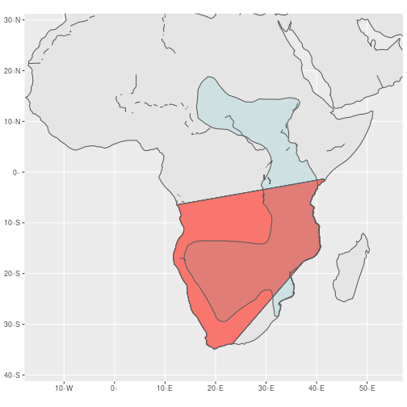

# sfe (Simple Features Ecology)
## A Walkthrough Guide With a Test Case

### A Breif Note about Dependencies
sfe was built in Ubuntu 18.04, and tested in Windows 10, so should work across
operating systems. However initial setup on Linux machines can be fairly complicated.

Here I shall give a brief guide on how to get things running on a Linux machine.
Start by running the command `install.packages("rgdal")` in R and watch to make 
sure it does actually install. If it doesn't its likely because the UbunutuGIS 
repository isn't signed so you will have to manually add this to trusted sources. 
Please see apt-secure(8) manpage and sources.list(5) manpage for details on what 
this actually means before moving on to the next section and doing that with 
the following commands on Linux terminal;
```
sudo add-apt-repository ppa:ubuntugis/ubuntugis-unstable 
    && sudo apt-get update
sudo gedit /etc/apt/sources.list.d/ubuntugis-ubuntu-ubuntu-ubuntugis-unstable-bionic.list
```
The second command will open a text document, where you must set a trusted = yes
flag. That looks like this; 
`deb [trusted=yes] http://ppa.launchpad.net/ubuntugis/ubuntugis-unstable/ubuntu bionic main`

Next step is to coerce Ubuntu into finding the gdal-config file which R and 
python3 need to install their versions of gdal. The following helped me work out what went wrong:
https://stackoverflow.com/questions/12141422/error-gdal-config%20-not-found 

If you don't want to read that, the following commands solved that issue for me,
and hopefully will for you too;
```
apt-file search gdal-config
sudo apt-get install libgdal1-dev
sudo apt-get update 
sudo apt-get upgrade
```
After running all of that rgdal should install in the usual way.
Next you may want to install rgeos manually, as this was another package I had 
issues with. to do that run `install.packages("rgeos")` in R followed by 
`sudo apt-get install libgeos-c1v5` on Linux Terminal. Re-run 
`install.packages("rgeos")` and you should be in business.

The final dependency you should install previous to trying to use sfe is `devtools`
This one is easy to install, simply running `install.packages("devtools")` should
be sufficient. 

## Installing sfe
In R run the command `devtools::install_github("JCur96/sfe", force =T)` followed
by

```r
library(sfe)
library(rgeos)
library(rgdal)
```
The package is now loaded and ready for use. 

## A walkthrough With a Test Case
Here I will run through the exact code I have used in my Masters Thesis as a 
demonstration of how to use this package. The test case I'm looking at are the 
Pangolins, that is species of the order Pholidota.

The NHM data can be kept under version control using datastorr and potentially 
downloaded with this package, however that data is currently proprietry so will 
be read off of my machine locally in this example.
For a more comprehensive overview of how to use datastorr please see the vignette
on https://github.com/ropenscilabs/datastorr
Initially setting up datastorr can be slightly difficult, but it boils down to 
running this command;
`datastorr:::autogenerate(repo="JCur96/sfe", read="read.csv")` which produces 
several functions which are then used for data management, and then making an 
initial release of the data. 
I will give a brief example of how to use those functions here out of 
interest; 

```r
# First it is advisable that you check if you've got the data already
sfe::mydata_versions()
#> character(0)
# If not, you can check what versions are avaliable on GitHub
sfe::mydata_versions(local=F)
#> [1] "0.0.0.9001"
# From those you can choose a version you wish to work with
myFakePangolinData <- sfe::mydata(version = '0.0.1')
#> Error in github_api_release_url(version, self$info$filename, self$info$repo, : No such release 0.0.1
# Once you've made any edits to the data you can upload it to version control
sfe::updateVersion()
#> Error in "IMPORTANT!\n  Please make note of whether the version update is due to changes to\n        data or because of updates made to the code in the package in your\n        commit message"/n: non-numeric argument to binary operator
# UpdateVersion helps you update the description file before you make a new release
sfe::mydata_release()
#> Error in datastorr::github_release_create(mydata_info(path), ...): filename must be given
```
The errors you see here are because I'm not giving the functions the correct 
input, but I promise they d0 work when they have correct input. 

First I read in the data from both Natural History Museum(NHM) and the IUCN.

```r
NHM_Pangolins <- read.csv("../data/NHMPangolins - in.csv", header=T)
#> Warning in file(file, "rt"): cannot open file '../data/NHMPangolins -
#> in.csv': No such file or directory
#> Error in file(file, "rt"): cannot open the connection
IUCN <- inReadOld(path = '../data', name = 'maps_pholidota')
#> [1] "This may take some time"
#> Error in ogrInfo(dsn = dsn, layer = layer, encoding = encoding, use_iconv = use_iconv, : Cannot open data source
```

Then I wrangle the data. This involves changing a key column to 
"binomial" as many of the functions to follow rely on the data having a column of
species names under the column header of "binomial". It also involves removing 
spaces from between binomial names, and filtering out blank or NA values from
other key columns, as well as converting both data frames to the sf format, 
making sure both are projected in latitude and longitude. 


```r
NHM_Pangolins <- prepNHMData(NHM_Pangolins, 6)
#>  [1] "RegistrationNumber" "Year"               "Decade"            
#>  [4] "binomial"           "TypeStatus"         "Continent"         
#>  [7] "Country"            "Locality"           "Extent_km"         
#> [10] "Certainty"          "Type"               "X"                 
#> [13] "binomial_overlap"   "distance"           "distance2"         
#> [16] "geometry"
#> Column name `binomial` must not be duplicated.
#> Use .name_repair to specify repair.
# To prove that this has done what we want, we can view the first ten rows
head(NHM_Pangolins)
#> Simple feature collection with 6 features and 15 fields
#> geometry type:  GEOMETRYCOLLECTION
#> dimension:      XY
#> bbox:           xmin: -6224372 ymin: 7705154 xmax: -297530.7 ymax: 10520410
#> epsg (SRID):    2163
#> proj4string:    +proj=laea +lat_0=45 +lon_0=-100 +x_0=0 +y_0=0 +a=6370997 +b=6370997 +units=m +no_defs
#>   RegistrationNumber Year Decade           binomial TypeStatus Continent
#> 1         72.11.13.1 1868   1860 Manis_pentadactyla       skin      Asia
#> 2         72.11.13.4 1867   1860 Manis_pentadactyla       skin      Asia
#> 3         72.11.13.7 1867   1860 Manis_pentadactyla       skin      Asia
#> 4         72.11.13.8 1868   1860 Manis_pentadactyla       skin      Asia
#> 5           7.7.3.25 1900   1900 Manis_pentadactyla       skin      Asia
#> 6          21.8.2.27 1920   1920 Manis_pentadactyla       skin      Asia
#>   Country Locality Extent_km Certainty Type X binomial_overlap distance
#> 1   China   Hainan    167.98       100  2.4                  1 57550.33
#> 2   China   Xiamen     46.93        50  2.3                  1 57550.33
#> 3   China   Xiamen     46.93        50  2.3                  1 57550.33
#> 4   China   Hainan    167.98       100  2.4                  1 57550.33
#> 5   China  Shantou     50.30        75  2.3                  1 57550.33
#> 6   India    Assam     92.64        75  2.2                  1 57550.33
#>   distance2                       geometry
#> 1        NA GEOMETRYCOLLECTION (POINT (...
#> 2        NA GEOMETRYCOLLECTION (POINT (...
#> 3        NA GEOMETRYCOLLECTION (POINT (...
#> 4        NA GEOMETRYCOLLECTION (POINT (...
#> 5        NA GEOMETRYCOLLECTION (POINT (...
#> 6        NA GEOMETRYCOLLECTION (POINT (...
# So it's not quite ready yet as it still contains a lot of missing values.
# Filtering out records which don't have a decade should help. 
# We also don't really need all the notes at the moment, so we can drop that column
NHM_Pangolins <- NHM_Pangolins %>% filter(Decade != is.na(Decade))
NHM_Pangolins <- NHM_Pangolins %>% select(-c(NOTES))
#> Error in map_lgl(.x, .p, ...): object 'NOTES' not found
head(NHM_Pangolins)
#> Simple feature collection with 6 features and 15 fields
#> geometry type:  GEOMETRYCOLLECTION
#> dimension:      XY
#> bbox:           xmin: -6224372 ymin: 7705154 xmax: -297530.7 ymax: 10520410
#> epsg (SRID):    2163
#> proj4string:    +proj=laea +lat_0=45 +lon_0=-100 +x_0=0 +y_0=0 +a=6370997 +b=6370997 +units=m +no_defs
#>   RegistrationNumber Year Decade           binomial TypeStatus Continent
#> 1         72.11.13.1 1868   1860 Manis_pentadactyla       skin      Asia
#> 2         72.11.13.4 1867   1860 Manis_pentadactyla       skin      Asia
#> 3         72.11.13.7 1867   1860 Manis_pentadactyla       skin      Asia
#> 4         72.11.13.8 1868   1860 Manis_pentadactyla       skin      Asia
#> 5           7.7.3.25 1900   1900 Manis_pentadactyla       skin      Asia
#> 6          21.8.2.27 1920   1920 Manis_pentadactyla       skin      Asia
#>   Country Locality Extent_km Certainty Type X binomial_overlap distance
#> 1   China   Hainan    167.98       100  2.4                  1 57550.33
#> 2   China   Xiamen     46.93        50  2.3                  1 57550.33
#> 3   China   Xiamen     46.93        50  2.3                  1 57550.33
#> 4   China   Hainan    167.98       100  2.4                  1 57550.33
#> 5   China  Shantou     50.30        75  2.3                  1 57550.33
#> 6   India    Assam     92.64        75  2.2                  1 57550.33
#>   distance2                       geometry
#> 1        NA GEOMETRYCOLLECTION (POINT (...
#> 2        NA GEOMETRYCOLLECTION (POINT (...
#> 3        NA GEOMETRYCOLLECTION (POINT (...
#> 4        NA GEOMETRYCOLLECTION (POINT (...
#> 5        NA GEOMETRYCOLLECTION (POINT (...
#> 6        NA GEOMETRYCOLLECTION (POINT (...
IUCN <- prepIUCNData(IUCN)
# head(IUCN)
```
Theres a lot of extra information in the IUCN data sets, but I won't filter that
out, depending on what you are doing different parts will be useful, and I cannot
devise an algorith to usefully sort that for every case.

I then filter both data sets to contain only species entries which occur in both
data sets. This function will reassign the IUCN data to the global environemnt
but with only matching species. I did this as a substitute for being able to 
return two objects from a function in R. 

```r
NHM_Pangolins <- matchBinomial(NHM_Pangolins, IUCN)
```

And can unify some naming conventions of Type, if the data has that information;

```r
NHM_Pangolins <- fixTypeNames(NHM_Pangolins)
```

Now that the data has been reduced to only usable records I can get into the meat 
of the functions I've writte; adding error to point data and converting that data
into convex hulls. 
First I need to change the Extent column into kilometers and rename it to reflect 
that change. Then I can add a `buffer` to the point data using the point-radius 
method. 

```r
NHM_Pangolins$Extent..m. <- (NHM_Pangolins$Extent..m. /1000)
#> Error in `[[<-.data.frame`(`*tmp*`, i, value = numeric(0)): replacement has 0 rows, data has 84
NHM_Pangolins <- NHM_Pangolins %>% rename(Extent_km = Extent..m.)
#> Error in .f(.x[[i]], ...): object 'Extent..m.' not found
NHM_Pangolins <- addError(NHM_Pangolins)
head(NHM_Pangolins)
#> Simple feature collection with 6 features and 15 fields
#> geometry type:  GEOMETRY
#> dimension:      XY
#> bbox:           xmin: 80.11534 ymin: 12.8766 xmax: 123.0893 ymax: 32.68449
#> epsg (SRID):    4326
#> proj4string:    +proj=longlat +datum=WGS84 +no_defs
#>   RegistrationNumber Year Decade           binomial TypeStatus Continent
#> 1         72.11.13.1 1868   1860 Manis_pentadactyla       skin      Asia
#> 2         72.11.13.4 1867   1860 Manis_pentadactyla       skin      Asia
#> 3         72.11.13.7 1867   1860 Manis_pentadactyla       skin      Asia
#> 4         72.11.13.8 1868   1860 Manis_pentadactyla       skin      Asia
#> 5           7.7.3.25 1900   1900 Manis_pentadactyla       skin      Asia
#> 6          21.8.2.27 1920   1920 Manis_pentadactyla       skin      Asia
#>   Country Locality Extent_km Certainty Type X binomial_overlap distance
#> 1   China   Hainan    167.98       100  2.4                  1 57550.33
#> 2   China   Xiamen     46.93        50  2.3                  1 57550.33
#> 3   China   Xiamen     46.93        50  2.3                  1 57550.33
#> 4   China   Hainan    167.98       100  2.4                  1 57550.33
#> 5   China  Shantou     50.30        75  2.3                  1 57550.33
#> 6   India    Assam     92.64        75  2.2                  1 57550.33
#>   distance2                       geometry
#> 1        NA POLYGON ((81.06553 30.73551...
#> 2        NA MULTIPOLYGON (((119.8157 23...
#> 3        NA MULTIPOLYGON (((119.8157 23...
#> 4        NA POLYGON ((81.06553 30.73551...
#> 5        NA MULTIPOLYGON (((119.7947 23...
#> 6        NA MULTIPOLYGON (((119.5306 23...
```

At this point I thought it would be useful to explore the data visually, both 
out of interest and to doube check that I really was converting point data into
point-radius data.

```r
# This function plots maps, but does not display them, it plots and saves them
# in a pre-made destination folder which you are prompted to enter the path to 
# when you run this funciton. This both saves computer time and memory, whilst 
# allowing you as the user to browse all the maps at your leisure. 
plotMaps(NHM_Pangolins, IUCN, path = '../output/point_radius_graphs/')
#> Error in grid.newpage(): could not open file '../output/point_radius_graphs/Manis_pentadactyla.png'

# Here is an example of a single plot from that command, or how to plot just one
# graph that is of interest
egForPlot <-NHM_Pangolins %>% filter(binomial == 'Smutsia_temminckii')
IUCNForPlot <- IUCN %>% filter(binomial == 'Smutsia_temminckii')
# puts the coords into the order expected down in ggmap coords
bbox <- c(-14.414063,-37.996163,53.613281,27.994401)
xlim <- c(bbox[1], bbox[3])
ylim <- c(bbox[2], bbox[4])
landMap <- rnaturalearth::ne_countries(returnclass = 'sf') %>% 
  st_union()
p = ggplot(data = landMap) + 
  geom_sf() +
  geom_sf(mapping = aes(alpha = 0.5, fill='blue'), data = egForPlot , show.legend = F) +
  geom_sf(mapping = aes(alpha = 0.1, fill = "red"), data = IUCNForPlot, show.legend = F) +
  coord_sf(xlim = xlim, ylim = ylim, expand = T)
print(p)
#> Error in grid.newpage(): could not open file '../output/point_radius_graphs/Manis_pentadactyla.png'
```

Not all maps will seem to show anything interesting, but that is mostly due to 
the scale of the maps versus the scale of the species ranges in some cases. 
Correctly scaling the maps is quite difficult as I am dealing with global 
distributions, whereas some range records seem to indicate a range of just a 
handful of kilometers. 

Some of these maps show range overlap, but what kind of percentage?
The next set of functions calculate percentage overlap between point-radius or 
convex hull data, depending on whether the user has utilised the convex hull 
generating functions yet or not. 

```r
# For speed and viewability we strip out all the extraneous stuff, 
# we just need the species name and the geometry 
myvars <- c('binomial', 'geometry')
IUCN <- IUCN[myvars]
IUCN <- resolveIUCNGeom(IUCN)
IUCN <- st_as_sf(IUCN)
class(IUCN)
#> [1] "sf"         "data.frame"
head(IUCN)
#> Simple feature collection with 6 features and 1 field
#> geometry type:  MULTIPOLYGON
#> dimension:      XY
#> bbox:           xmin: -16.79792 ymin: -29.46794 xmax: 121.9982 ymax: 34.53434
#> epsg (SRID):    4326
#> proj4string:    +proj=longlat +datum=WGS84 +no_defs
#>                  binomial                       geometry
#> 1     Manis_crassicaudata MULTIPOLYGON (((80.21467 9....
#> 2 Phataginus_tetradactyla MULTIPOLYGON (((7.1426 5.88...
#> 3      Manis_pentadactyla MULTIPOLYGON (((120.7737 22...
#> 4       Manis_culionensis MULTIPOLYGON (((116.9543 8....
#> 5      Smutsia_temminckii MULTIPOLYGON (((25.8803 13....
#> 6        Smutsia_gigantea MULTIPOLYGON (((8.733124 3....
# NHM_Pangolins$Percent_overlap <- NA
head(NHM_Pangolins)
#> Simple feature collection with 6 features and 15 fields
#> geometry type:  GEOMETRY
#> dimension:      XY
#> bbox:           xmin: 80.11534 ymin: 12.8766 xmax: 123.0893 ymax: 32.68449
#> epsg (SRID):    4326
#> proj4string:    +proj=longlat +datum=WGS84 +no_defs
#>   RegistrationNumber Year Decade           binomial TypeStatus Continent
#> 1         72.11.13.1 1868   1860 Manis_pentadactyla       skin      Asia
#> 2         72.11.13.4 1867   1860 Manis_pentadactyla       skin      Asia
#> 3         72.11.13.7 1867   1860 Manis_pentadactyla       skin      Asia
#> 4         72.11.13.8 1868   1860 Manis_pentadactyla       skin      Asia
#> 5           7.7.3.25 1900   1900 Manis_pentadactyla       skin      Asia
#> 6          21.8.2.27 1920   1920 Manis_pentadactyla       skin      Asia
#>   Country Locality Extent_km Certainty Type X binomial_overlap distance
#> 1   China   Hainan    167.98       100  2.4                  1 57550.33
#> 2   China   Xiamen     46.93        50  2.3                  1 57550.33
#> 3   China   Xiamen     46.93        50  2.3                  1 57550.33
#> 4   China   Hainan    167.98       100  2.4                  1 57550.33
#> 5   China  Shantou     50.30        75  2.3                  1 57550.33
#> 6   India    Assam     92.64        75  2.2                  1 57550.33
#>   distance2                       geometry
#> 1        NA POLYGON ((81.06553 30.73551...
#> 2        NA MULTIPOLYGON (((119.8157 23...
#> 3        NA MULTIPOLYGON (((119.8157 23...
#> 4        NA POLYGON ((81.06553 30.73551...
#> 5        NA MULTIPOLYGON (((119.7947 23...
#> 6        NA MULTIPOLYGON (((119.5306 23...
NHM_Pangolins <- calculateOverlaps(NHM_Pangolins, IUCN)
#> Error in CPL_geos_op2(op, st_geometry(x), st_geometry(y)): Evaluation error: TopologyException: Input geom 0 is invalid: Self-intersection at or near point -5030615.1991173597 10299997.573691372 at -5030615.1991173597 10299997.573691372.
head(NHM_Pangolins)
#> Simple feature collection with 6 features and 15 fields
#> geometry type:  GEOMETRY
#> dimension:      XY
#> bbox:           xmin: 80.11534 ymin: 12.8766 xmax: 123.0893 ymax: 32.68449
#> epsg (SRID):    4326
#> proj4string:    +proj=longlat +datum=WGS84 +no_defs
#>   RegistrationNumber Year Decade           binomial TypeStatus Continent
#> 1         72.11.13.1 1868   1860 Manis_pentadactyla       skin      Asia
#> 2         72.11.13.4 1867   1860 Manis_pentadactyla       skin      Asia
#> 3         72.11.13.7 1867   1860 Manis_pentadactyla       skin      Asia
#> 4         72.11.13.8 1868   1860 Manis_pentadactyla       skin      Asia
#> 5           7.7.3.25 1900   1900 Manis_pentadactyla       skin      Asia
#> 6          21.8.2.27 1920   1920 Manis_pentadactyla       skin      Asia
#>   Country Locality Extent_km Certainty Type X binomial_overlap distance
#> 1   China   Hainan    167.98       100  2.4                  1 57550.33
#> 2   China   Xiamen     46.93        50  2.3                  1 57550.33
#> 3   China   Xiamen     46.93        50  2.3                  1 57550.33
#> 4   China   Hainan    167.98       100  2.4                  1 57550.33
#> 5   China  Shantou     50.30        75  2.3                  1 57550.33
#> 6   India    Assam     92.64        75  2.2                  1 57550.33
#>   distance2                       geometry
#> 1        NA POLYGON ((81.06553 30.73551...
#> 2        NA MULTIPOLYGON (((119.8157 23...
#> 3        NA MULTIPOLYGON (((119.8157 23...
#> 4        NA POLYGON ((81.06553 30.73551...
#> 5        NA MULTIPOLYGON (((119.7947 23...
#> 6        NA MULTIPOLYGON (((119.5306 23...
```

The above function will return the NHM data frame with a `Percent_overlap` column
added, the contents of which is calculated from the geometry column of the data.

The geometry column could either be point-radius or a fully realised convex hull,
which can be created and tailored using the following functions; 


```r
# This first function creates convex hulls, without any clipping to landmasses
NHM_Pangolins <- makeConvexHulls(NHM_Pangolins)
# And this function takes those hulls and clips them to landmasses 
head(NHM_Pangolins)
#> Simple feature collection with 6 features and 15 fields
#> geometry type:  POLYGON
#> dimension:      XY
#> bbox:           xmin: 75.90632 ymin: 9.942344 xmax: 125.8511 ymax: 36.37283
#> epsg (SRID):    4326
#> proj4string:    +proj=longlat +datum=WGS84 +no_defs
#>   RegistrationNumber Year Decade           binomial TypeStatus Continent
#> 1         72.11.13.1 1868   1860 Manis_pentadactyla       skin      Asia
#> 2         72.11.13.4 1867   1860 Manis_pentadactyla       skin      Asia
#> 3         72.11.13.7 1867   1860 Manis_pentadactyla       skin      Asia
#> 4         72.11.13.8 1868   1860 Manis_pentadactyla       skin      Asia
#> 5           7.7.3.25 1900   1900 Manis_pentadactyla       skin      Asia
#> 6          21.8.2.27 1920   1920 Manis_pentadactyla       skin      Asia
#>   Country Locality Extent_km Certainty Type X binomial_overlap distance
#> 1   China   Hainan    167.98       100  2.4                  1 57550.33
#> 2   China   Xiamen     46.93        50  2.3                  1 57550.33
#> 3   China   Xiamen     46.93        50  2.3                  1 57550.33
#> 4   China   Hainan    167.98       100  2.4                  1 57550.33
#> 5   China  Shantou     50.30        75  2.3                  1 57550.33
#> 6   India    Assam     92.64        75  2.2                  1 57550.33
#>   distance2                       geometry
#> 1        NA POLYGON ((109.0818 9.942344...
#> 2        NA POLYGON ((109.0818 9.942344...
#> 3        NA POLYGON ((109.0818 9.942344...
#> 4        NA POLYGON ((109.0818 9.942344...
#> 5        NA POLYGON ((109.0818 9.942344...
#> 6        NA POLYGON ((109.0818 9.942344...
NHM_Pangolins <- clipHullsToLand(NHM_Pangolins)
#If you know you want hulls which are clipped to landmasses from the start you 
# can use the following function
NHM_Pangolins <- makeLandClippedHulls(NHM_Pangolins)
```

All of the above will give a percentage overlap with IUCN convex hulls, but for 
analysis percentage is a tricky thing to work with, so I have created another 
function to flatten the data to binomial (1 or 0) data, which makes modelling 
with this data much easier.

The previous plotting code can be used again here to visulaise the results of 
creating convex hulls. I would recommend creating a new folder for these unless 
you dont mind overwriting the previous plots. 


```r
# Here is an example of a single plot from that command, or how to plot just one
# graph that is of interest
egForPlot <-NHM_Pangolins %>% filter(binomial == 'Smutsia_temminckii')
IUCNForPlot <- IUCN %>% filter(binomial == 'Smutsia_temminckii')
# puts the coords into the order expected down in ggmap coords
bbox <- c(-14.414063,-37.996163,53.613281,27.994401)
xlim <- c(bbox[1], bbox[3])
ylim <- c(bbox[2], bbox[4])
landMap <- rnaturalearth::ne_countries(returnclass = 'sf') %>% 
  st_union()
p = ggplot(data = landMap) + 
  geom_sf() +
  geom_sf(mapping = aes(alpha = 0.5, fill='blue'), data = egForPlot , show.legend = F) +
  geom_sf(mapping = aes(alpha = 0.1, fill = "red"), data = IUCNForPlot, show.legend = F) +
  coord_sf(xlim = xlim, ylim = ylim, expand = T)
print(p)
```



Similarly I can calculate the percentage overlap between convex hulls and using 
the `calculateOverlaps` function from earlier. 

```r
NHM_Pangolins <- calculateOverlaps(NHM_Pangolins, IUCN)
head(NHM_Pangolins)
#> Simple feature collection with 6 features and 16 fields
#> geometry type:  GEOMETRYCOLLECTION
#> dimension:      XY
#> bbox:           xmin: -4678013 ymin: 525265.6 xmax: 9871394 ymax: 11501860
#> epsg (SRID):    2163
#> proj4string:    +proj=laea +lat_0=45 +lon_0=-100 +x_0=0 +y_0=0 +a=6370997 +b=6370997 +units=m +no_defs
#>    RegistrationNumber Year Decade            binomial TypeStatus Continent
#> 81         35.12.18.3 1935   1930    Smutsia_gigantea   skeleton    Africa
#> 82            61.1095 1905   1900    Smutsia_gigantea       skin    Africa
#> 83            61.1096 1913   1910    Smutsia_gigantea       skin    Africa
#> 84             no reg 1946   1940    Smutsia_gigantea       skin    Africa
#> 74        27.12.1.203 1927   1920 Manis_crassicaudata       skin      Asia
#> 75           34.3.4.1 1933   1930 Manis_crassicaudata       skin      Asia
#>                             Country                Locality Extent_km
#> 81                      South Sudan Northern Bahr el Ghazal    145.39
#> 82                           Uganda                   Buddu      4.92
#> 83 Democratic Republic of the Congo               Lake Kivu     62.79
#> 84                     Sierra Leone             Sulima (Nr)      3.08
#> 74                          Vietnam                 Bac-Kan     66.71
#> 75                            Burma                  Ho Khu      0.05
#>    Certainty Type X binomial_overlap distance distance2 Percent_overlap
#> 81       100  2.2                  1 422985.6        NA        43.75624
#> 82        25  2.3                  1 422985.6        NA        43.75624
#> 83        25  2.7                  1 422985.6        NA        43.75624
#> 84        75  3.5                  1 422985.6        NA        43.75624
#> 74       100  2.2                  1      0.0        NA        15.22015
#> 75        75  3.3                  1      0.0        NA        15.22015
#>                          geometry
#> 81 GEOMETRYCOLLECTION (POINT (...
#> 82 GEOMETRYCOLLECTION (POINT (...
#> 83 GEOMETRYCOLLECTION (POINT (...
#> 84 GEOMETRYCOLLECTION (POINT (...
#> 74 GEOMETRYCOLLECTION (POINT (...
#> 75 GEOMETRYCOLLECTION (POINT (...
```
This function changes the `Percent_overlap` column to `binomial_overlap` as well
as flatten the data.

```r
NHM_Pangolins <- binomialOverlap(NHM_Pangolins)
#> Warning in if ((subsetOfDf$Percent_overlap > 0) == T) {: the condition has
#> length > 1 and only the first element will be used

#> Warning in if ((subsetOfDf$Percent_overlap > 0) == T) {: the condition has
#> length > 1 and only the first element will be used

#> Warning in if ((subsetOfDf$Percent_overlap > 0) == T) {: the condition has
#> length > 1 and only the first element will be used

#> Warning in if ((subsetOfDf$Percent_overlap > 0) == T) {: the condition has
#> length > 1 and only the first element will be used

#> Warning in if ((subsetOfDf$Percent_overlap > 0) == T) {: the condition has
#> length > 1 and only the first element will be used

#> Warning in if ((subsetOfDf$Percent_overlap > 0) == T) {: the condition has
#> length > 1 and only the first element will be used

#> Warning in if ((subsetOfDf$Percent_overlap > 0) == T) {: the condition has
#> length > 1 and only the first element will be used
head(NHM_Pangolins)
#> Simple feature collection with 6 features and 16 fields
#> geometry type:  GEOMETRYCOLLECTION
#> dimension:      XY
#> bbox:           xmin: -4678013 ymin: 525265.6 xmax: 9871394 ymax: 11501860
#> epsg (SRID):    2163
#> proj4string:    +proj=laea +lat_0=45 +lon_0=-100 +x_0=0 +y_0=0 +a=6370997 +b=6370997 +units=m +no_defs
#>    RegistrationNumber Year Decade            binomial TypeStatus Continent
#> 81         35.12.18.3 1935   1930    Smutsia_gigantea   skeleton    Africa
#> 82            61.1095 1905   1900    Smutsia_gigantea       skin    Africa
#> 83            61.1096 1913   1910    Smutsia_gigantea       skin    Africa
#> 84             no reg 1946   1940    Smutsia_gigantea       skin    Africa
#> 74        27.12.1.203 1927   1920 Manis_crassicaudata       skin      Asia
#> 75           34.3.4.1 1933   1930 Manis_crassicaudata       skin      Asia
#>                             Country                Locality Extent_km
#> 81                      South Sudan Northern Bahr el Ghazal    145.39
#> 82                           Uganda                   Buddu      4.92
#> 83 Democratic Republic of the Congo               Lake Kivu     62.79
#> 84                     Sierra Leone             Sulima (Nr)      3.08
#> 74                          Vietnam                 Bac-Kan     66.71
#> 75                            Burma                  Ho Khu      0.05
#>    Certainty Type X binomial_overlap distance distance2 binomial_overlap
#> 81       100  2.2                  1 422985.6        NA                1
#> 82        25  2.3                  1 422985.6        NA                1
#> 83        25  2.7                  1 422985.6        NA                1
#> 84        75  3.5                  1 422985.6        NA                1
#> 74       100  2.2                  1      0.0        NA                1
#> 75        75  3.3                  1      0.0        NA                1
#>                          geometry
#> 81 GEOMETRYCOLLECTION (POINT (...
#> 82 GEOMETRYCOLLECTION (POINT (...
#> 83 GEOMETRYCOLLECTION (POINT (...
#> 84 GEOMETRYCOLLECTION (POINT (...
#> 74 GEOMETRYCOLLECTION (POINT (...
#> 75 GEOMETRYCOLLECTION (POINT (...
```

I have also created a function for calculating the distance between the centroid 
of the NHM data and the edge of the IUCN data, as I feel that this distance might
be of interest with regards to analysis and modelling, and does not requrie any
flattening to use. 

```r
NHM_Pangolins <- centroidEdgeDistance(NHM_Pangolins, IUCN)
head(NHM_Pangolins)
#> Simple feature collection with 6 features and 16 fields
#> geometry type:  GEOMETRYCOLLECTION
#> dimension:      XY
#> bbox:           xmin: -4678013 ymin: 525265.6 xmax: 9871394 ymax: 11501860
#> epsg (SRID):    2163
#> proj4string:    +proj=laea +lat_0=45 +lon_0=-100 +x_0=0 +y_0=0 +a=6370997 +b=6370997 +units=m +no_defs
#>    RegistrationNumber Year Decade            binomial TypeStatus Continent
#> 81         35.12.18.3 1935   1930    Smutsia_gigantea   skeleton    Africa
#> 82            61.1095 1905   1900    Smutsia_gigantea       skin    Africa
#> 83            61.1096 1913   1910    Smutsia_gigantea       skin    Africa
#> 84             no reg 1946   1940    Smutsia_gigantea       skin    Africa
#> 74        27.12.1.203 1927   1920 Manis_crassicaudata       skin      Asia
#> 75           34.3.4.1 1933   1930 Manis_crassicaudata       skin      Asia
#>                             Country                Locality Extent_km
#> 81                      South Sudan Northern Bahr el Ghazal    145.39
#> 82                           Uganda                   Buddu      4.92
#> 83 Democratic Republic of the Congo               Lake Kivu     62.79
#> 84                     Sierra Leone             Sulima (Nr)      3.08
#> 74                          Vietnam                 Bac-Kan     66.71
#> 75                            Burma                  Ho Khu      0.05
#>    Certainty Type X binomial_overlap distance distance2 binomial_overlap.1
#> 81       100  2.2                  1 419829.1        NA                  1
#> 82        25  2.3                  1 419829.1        NA                  1
#> 83        25  2.7                  1 419829.1        NA                  1
#> 84        75  3.5                  1 419829.1        NA                  1
#> 74       100  2.2                  1      0.0        NA                  1
#> 75        75  3.3                  1      0.0        NA                  1
#>                          geometry
#> 81 GEOMETRYCOLLECTION (POINT (...
#> 82 GEOMETRYCOLLECTION (POINT (...
#> 83 GEOMETRYCOLLECTION (POINT (...
#> 84 GEOMETRYCOLLECTION (POINT (...
#> 74 GEOMETRYCOLLECTION (POINT (...
#> 75 GEOMETRYCOLLECTION (POINT (...
```

This returns the NHM data frame with added an added distance column (and a 
distance2 column, as there are a few IUCN records with two range polygons, and 
without this inclusion the function will not run). 

------

The above test case gives a run through of all of the functions included in this
package, below I shall continue with the analysis of the test case, however none
of the functions below are of my creation, so I will not be offering much in the 
way of tutorial. 

## Analysing The Output

To analyse what I have generated I will need to use mixed effect models. I am 
familiar with lme4 and lmerTest, so I will use those packages, however any mixed
effect package should be sufficent. 

```r
# install.packages('lme4')
# install.packages('lmerTest')
library(lme4)
#> Loading required package: Matrix
library(lmerTest)
#> 
#> Attaching package: 'lmerTest'
#> The following object is masked from 'package:lme4':
#> 
#>     lmer
#> The following object is masked from 'package:stats':
#> 
#>     step
```

In theory, the data have now been treated in such a way that constructing the 
models that I wish to explore will be extremely simple. 


```r
binomialModel <- glmer(binomial_overlap ~ decade + (1|binomial), 
                       data = NHM_Pangolins, family = 'binomial')
#> Error in eval(predvars, data, env): object 'decade' not found
distanceModel <- glmer(distance ~ decade + (1|binomial),
                       data = NHM_Pangolins, family = 'gaussian')
#> Warning in glmer(distance ~ decade + (1 | binomial), data =
#> NHM_Pangolins, : calling glmer() with family=gaussian (identity link) as a
#> shortcut to lmer() is deprecated; please call lmer() directly
#> Error in eval(predvars, data, env): object 'decade' not found

# And then we plot some these just to see
# WILL BE USING GGPLOT FOR THIS BUT FOR STARTERS LETS JUST BASE PLOT
plot(binomialModel)
#> Error in plot(binomialModel): object 'binomialModel' not found
plot(distanceModel)
#> Error in plot(distanceModel): object 'distanceModel' not found
# or potentially

binomialModel2 <- glmer(binomial_overlap ~ binomial + (1|decade), 
                       data = NHM_Pangolins, family = 'binomial')
#> Error in eval(predvars, data, env): object 'decade' not found
distanceModel2 <- glmer(distance ~ binomial + (1|decade),
                       data = NHM_Pangolins, family = 'gaussian')
#> Warning in glmer(distance ~ binomial + (1 | decade), data =
#> NHM_Pangolins, : calling glmer() with family=gaussian (identity link) as a
#> shortcut to lmer() is deprecated; please call lmer() directly
#> Error in eval(predvars, data, env): object 'decade' not found

# And then we plot some these just to see
# WILL BE USING GGPLOT FOR THIS BUT FOR STARTERS LETS JUST BASE PLOT 
plot(binomialModel2)
#> Error in plot(binomialModel2): object 'binomialModel2' not found
plot(distanceModel2)
#> Error in plot(distanceModel2): object 'distanceModel2' not found
```
